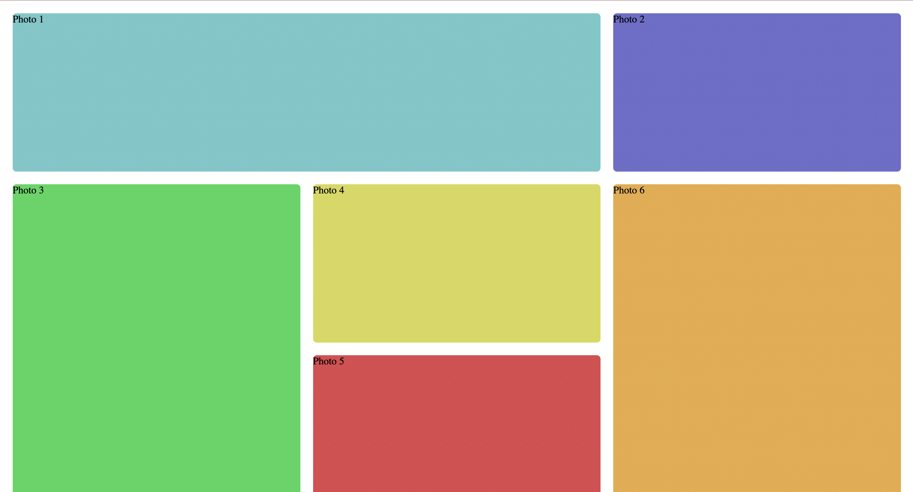
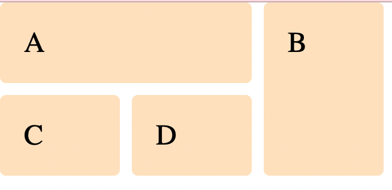
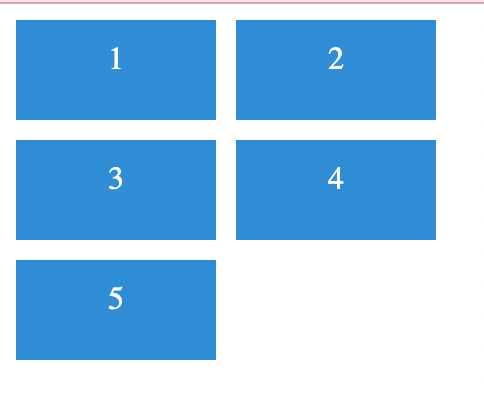
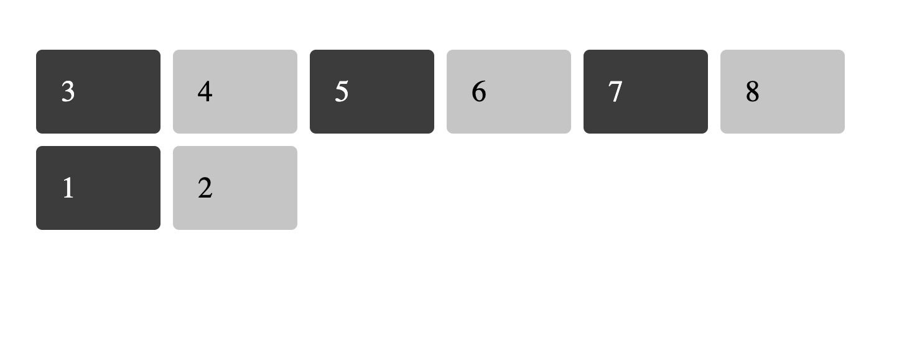
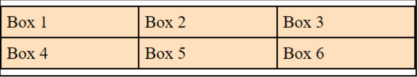
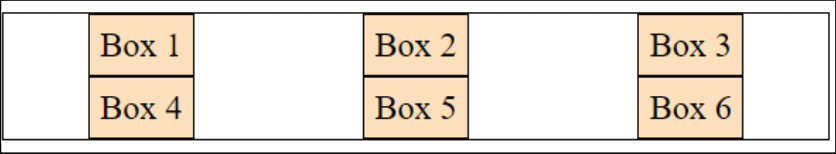

## Assignment - Grid in CSS

#### Q1. Create an image gallery using a CSS grid.

Answer:

#### Q2. Write code to arrange containers with texts A, B, C, and D as shown in the below image.

Answer: 

#### Q3. Explain the use of grid-auto-row and grid-auto-column using code examples.

Answer:

#### 4. Explain the use of grid-auto-row and grid-auto-column using code examples.

Answer: 

#### 5. Explain the difference between justify-items and justify-self using code examples.

Answer: The main difference between them is that justify-items apply to grid containers and justify-self applies to grid-items.

