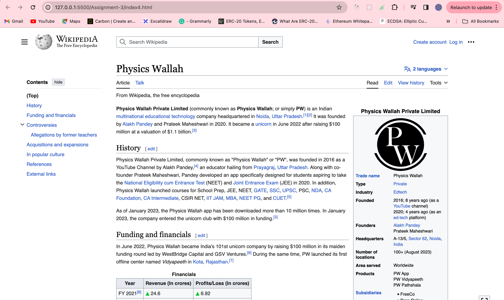

## Assignment-3 - Media and Forms

### Q1. Create an image gallery that holds multiple images?

Answer: Index1.html

### Q2. Use video and audio tags to display video and audio with the playback, audio controls?

Answer: Index2.html

### Q3. Modify the previous assignment so that the audio and video play automatically as the page is loaded and they should play infinitely.

Answer: Index3.html

### Q4. use iframe to embed the PhysicsWallah wikipedia page properly?

Answer: Index4.html

### Q5. Create a sign-up and sign-in form with proper validation.

#### a. Sign up form should have a first name, email, password, confirm password, age, gender and agree to terms and conditions fields at minimum(You can ad any other if you like).

Answer: Index5-a.html

#### b. Sign in form should have email, password fields.

Answer: Index5-b.html

