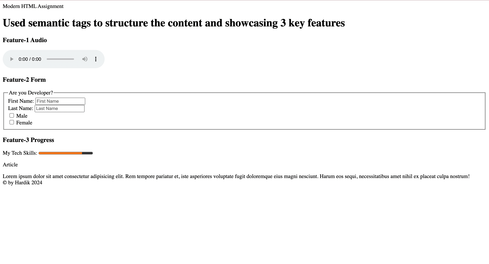
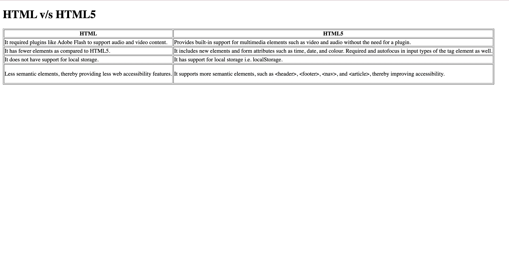

### Assignment 4 - Modern HTML

#### Q1. List out the features of HTML5?

Answer: HTML 5 provide several new features. some of them are list below -

- `New Doc Type`: HTML5 simplifies and standardizes the document declaration for better compatibility.
- `Semantic Elements`: HTML5 has provided semantic elements which helps you to structure your webpage easily like: `<nav>, <header>, <main>, <footer>, <section>, <aside>, <article>, <time>, <mark>, <figure>, <progress>, <output>, <figcaption>`.
- `Multi-media Support`: You can easily add audio and video content without needing of third party plugin. Using <audio> <video> element.
- `Canvas Support`: With <canvas> element, you can easily create dynamic and interactive graphics.
- `GeoLocation API Support`: With the help of geo location web application can enable user location.
- `Form Features`: HTML5 has provided several features to form. Enhance form handling, better user experience.

#### Q2. What are HTML Entities? List out 5 commonly used HTML entities.

Answer: HTML entities are codes used to represent reserved characters in HTML. Five commonly used entities are:

`&lt;` - < (less-than sign)
`&gt;` - > (greater-than sign)
`&amp;` - & (ampersand)
`&quot;` - " (double quotation mark)
`&apos;` or `&#39;` - ' (single quotation mark or apostrophe)

#### Q3. Define accessibility in the context of web development. Discuss why it's essential to create accessible websites and how it benefits different user groups.

Answer: Accessibility in the context of web development refers to the practice of designing and developing websites and web applications in a way that ensures they can be easily accessed and used by people with diverse abilities and disabilities. This includes making digital content and user interfaces perceivable, operable, understandable, and robust for all users, regardless of their physical or cognitive abilities.

Creating accessible websites is essential for several reasons:

- Inclusivity: Accessible design ensures that everyone, regardless of their abilities, can access and use web content. This inclusivity is a fundamental aspect of promoting equal opportunities and preventing discrimination.

- Legal Compliance: In many regions, there are legal requirements and standards (e.g., the Americans with Disabilities Act in the United States or the Web Content Accessibility Guidelines, WCAG) that mandate websites to be accessible. Non-compliance may result in legal consequences.

- Broader Audience Reach: An accessible website caters to a larger audience, including people with disabilities. This not only broadens the user base but also makes good business sense by tapping into diverse markets.

- Search Engine Optimization (SEO): Many accessibility practices align with good SEO practices. For example, providing descriptive alt text for images not only helps screen reader users but also benefits search engines in understanding the content of images.

- Enhanced Usability: Accessible design often leads to improved usability for all users. Clear navigation, well-structured content, and consistent design contribute to a positive user experience.

- Technological Advancements: As technology evolves, new ways of accessing digital content emerge. Creating accessible websites ensures compatibility with current and future assistive technologies, such as screen readers, voice recognition software, or alternative input devices.

- Social Responsibility: Promoting accessibility is a matter of social responsibility. By making digital experiences inclusive, web developers contribute to a more equitable and accessible online environment.

Different user groups benefit from accessible websites in various ways:

- Visually Impaired Users: Screen readers convert text into speech or braille, enabling visually impaired users to access and understand web content.

- Motor Impaired Users: Keyboard shortcuts, voice commands, or alternative input methods help users with motor impairments navigate and interact with websites.

- Cognitive Impaired Users: Clear and simple language, consistent navigation, and well-organized content assist users with cognitive impairments in understanding and interacting with web content.

- Deaf or Hard of Hearing Users: Subtitles, transcripts, and captions for multimedia content ensure that deaf or hard of hearing users can access information presented through audio or video.

- Elderly Users: Accessible design principles, such as larger fonts and simple navigation, benefit elderly users who may experience age-related impairments.

In conclusion, creating accessible websites is crucial for fostering inclusivity, complying with legal requirements, reaching a broader audience, and providing a positive user experience for everyone. It aligns with ethical considerations, legal obligations, and business strategies, making it an integral part of modern web development.

#### Q4. List any 3 ways which help us in improving the accessibility of HTML.

Answer:

Improving the accessibility of HTML is essential for ensuring that web content is usable by a wide range of people, including those with disabilities. Here are three ways to enhance HTML accessibility:

- `Semantic HTML`:
  Use semantic HTML elements to provide meaningful structure and information to both users and assistive technologies. For example, use <header>, <nav>, <main>, <article>, <section>, and <footer> tags appropriately to organize content. Semantic HTML helps screen readers and other assistive technologies understand the document's structure, improving the overall user experience.

<header>
  <h1>Page Title</h1>
</header>
<nav>
  <ul>
    <li><a href="#">Home</a></li>
    <li><a href="#">About</a></li>
    <li><a href="#">Contact</a></li>
  </ul>
</nav>
<main>
  <article>
    <h2>Article Title</h2>
    
Article content...

  </article>
</main>
<footer>
  
&copy; 2024 Your Website

</footer>
`

- `Provide Text Alternatives for Images`:
  Include descriptive alternative text for images using the alt attribute. This is crucial for users who rely on screen readers or those with slow internet connections where images may not load. The alternative text should convey the essential information or function of the image.
  ``

- `Keyboard Accessibility`:
  Ensure that all interactive elements on your website are accessible via keyboard navigation. Users with mobility issues or those who cannot use a mouse rely on keyboard input. Use the tabindex attribute to define the tab order of interactive elements and make sure that focus styles are clearly visible. Additionally, test and ensure that all interactive components (buttons, links, forms) can be operated using only the keyboard.
  `<button tabindex="0">Click me</button>`
  By incorporating these practices, you can significantly improve the accessibility of your HTML content, making it more inclusive for all users.

#### Q5. Create a web page that highlights the feature of HTML5. Use appropriate semantic tags to structure the content and showcase at least three key features of HTML5 with explanations.

Answer: ./index1.html

#### Q6. Create a simple web page which has a table. The table must have a columns HTML and HTML5. The table should include a minimum of three rows describing the differences between HTML and HTML5.

Answer: ./index2.html

