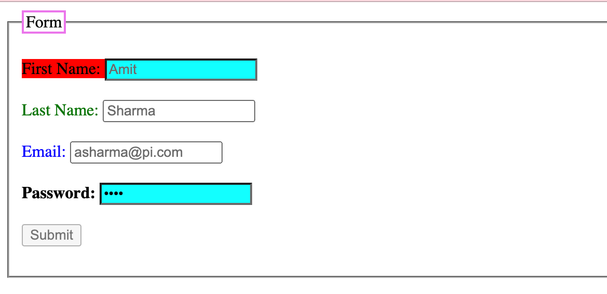

## Assignment 6 - Starting with CSS

### Q1. Create a simple web page with some div tags and show different ways to add css as well as what happens when you target the same elements with inline, internal, and external CSS. Also, utilize comments in the project where require.

Answere: index1.html

### Q2. Build an HTML page with multiple paragraph, each assigned a unique class name. Write css rules using class selectors to apply distinct styling to each paragraph. Follow the BEM naming convention and explained how you have named the class

Answere: index2.html

### Q3. Develop an HTML form with various input elements. Use CSS to style the form, including setting background colors for input files. Create a custom color palette for the form elements, and demonstrate how to apply opacity to one of the form sections.

Answere: index3.html

