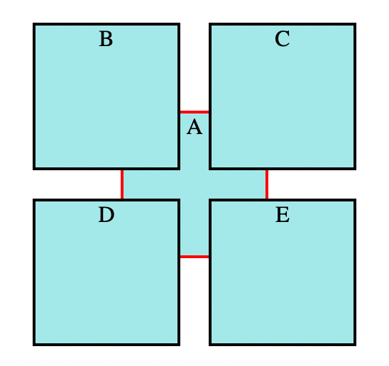
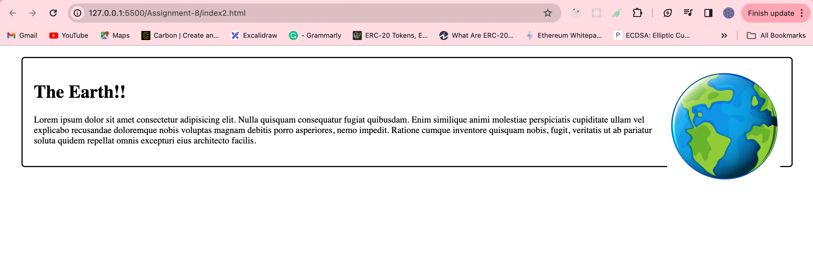
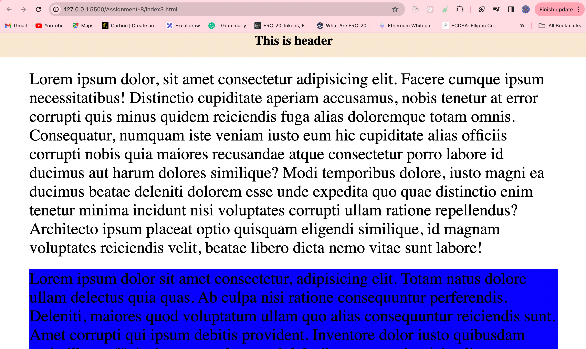
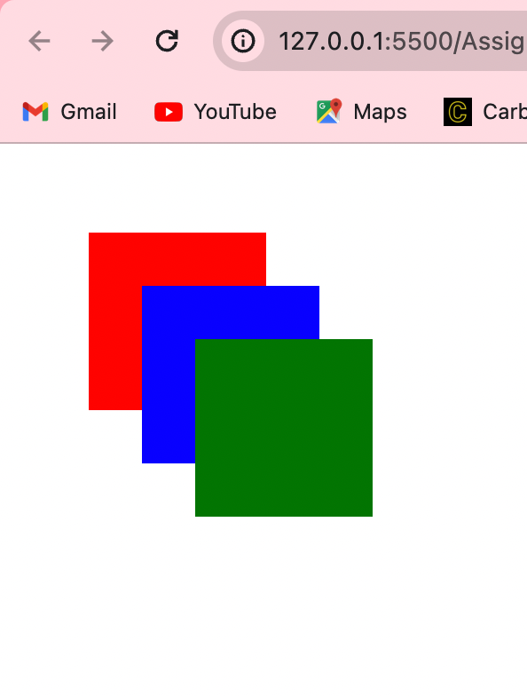

### Assignment - Position in CSS

#### Q1. Write code to position 5 equal-sized(50x50) boxes A,B,C,D and E as follow

1. box A 200px from the left, and 200px from the top of the viewportH
2. box B -30px left, and -30px above from the center of box A.
3. box B -30px right, and -30px above from the center of box A.
4. box B -30px left, and -30px below from the center of box A.
5. box B -30px right, and -30px below from the center of box A.

Answer: index1.html

#### Q2. Explain the difference between Absolute and Relative positioning.

Answer: Absolute and relative positioning are two commonly used concepts in web design and CSS (Cascading Style Sheets) that determine how elements are positioned within a document. Here's a brief explanation of the key differences between absolute and relative positioning:

1. **Reference Point:**

   - **Absolute Positioning:** Elements with absolute positioning are positioned relative to the nearest positioned ancestor (an ancestor with a position property other than static) or the initial containing block if no positioned ancestor is found.
   - **Relative Positioning:** Elements with relative positioning are positioned relative to their normal position in the document flow. They can be moved from this position using the top, right, bottom, and left properties.

2. **Document Flow:**

   - **Absolute Positioning:** Elements with absolute positioning are taken out of the normal document flow. This means that other elements in the document will not be affected by the absolute-positioned element's presence or absence.
   - **Relative Positioning:** Elements with relative positioning still occupy space in the normal document flow. Other elements will be positioned as if the relatively positioned element is in its normal place.

3. **Impact on Sibling Elements:**

   - **Absolute Positioning:** Absolute positioning can overlap with other elements. If an absolutely positioned element overlaps with a sibling element, it may obscure or be obscured by that sibling.
   - **Relative Positioning:** Elements with relative positioning do not overlap with other elements in the normal flow. They may appear to have moved, but their original space in the document flow is still reserved.

4. **Initial Positioning:**
   - **Absolute Positioning:** The initial position of an element with absolute positioning is usually determined by setting the values of the top, right, bottom, or left properties.
   - **Relative Positioning:** The initial position of an element with relative positioning is its normal position in the document flow. It can then be adjusted using the top, right, bottom, or left properties.

In summary, absolute positioning removes an element from the normal document flow and positions it relative to a specified ancestor, while relative positioning retains the element in the normal flow and adjusts its position relative to its normal place. Choosing between absolute and relative positioning depends on the specific layout and design requirements of a webpage.

#### Q3. Create a card as shown in the picture below.

Answer: index2.html

#### Q4. Create a simple header that sticks to the top of a webpage upon scrolling.

Answer: index3.html

#### Q5. Explain the z-index, with a code example.

Answer: `z-index` is a CSS property that determines the stacking order of positioned elements on a webpage along the z-axis. Elements with a higher z-index value are positioned in front of elements with lower values. This property is particularly useful when dealing with overlapping elements, allowing you to control which element appears on top.

