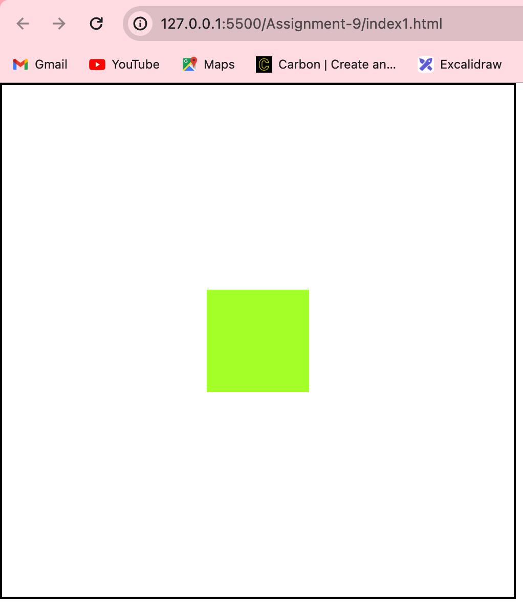
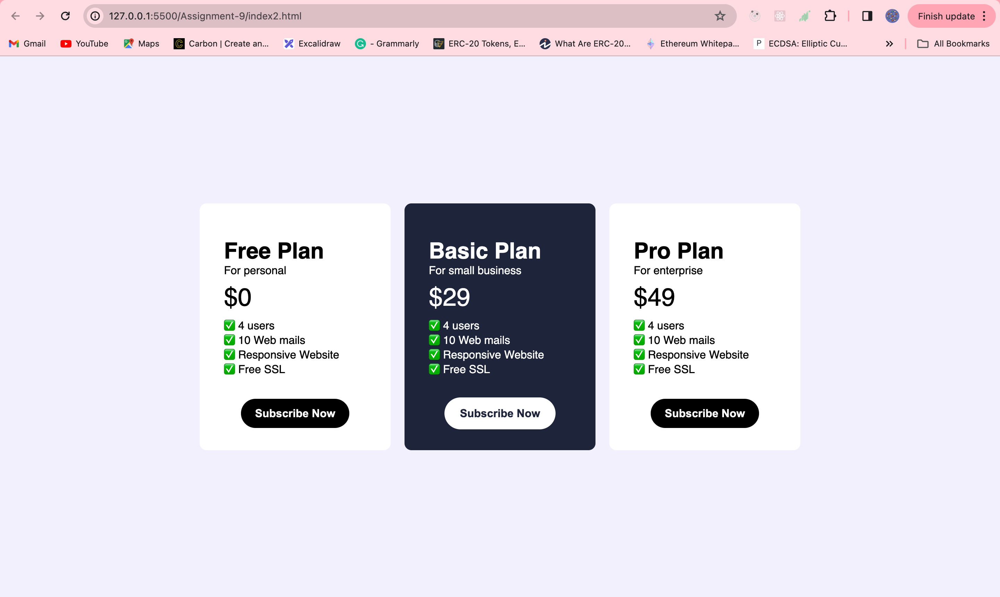

## Assignment - Flexbox in CSS

#### Q1. Describe the main differences between the CSS Flexbox layout model and the css grid layout model. When would you choose to use one over the other?

Answer:

#### Q2. Explain the role of the following key properties in the flexbox layout model

1. justify-center
2. align-items
3. gap flex-direction
4. flex-wrap

Answer:

#### Q3. Write a code to center a div using css flexbox

Answer: index1.html

#### Q4. Build pricing section of the webpage.

Figma Link: https://www.figma.com/file/jxwr0JO61tF9P06mmE9gph/Pricing-Card---Mark-1-(Community)-(Copy)?type=design&node-id=7-129&mode=design

Answer: index2.html

#### Q5. Build clone of IRCTC ticket booking page.

Figma Link: (https://www.figma.com/file/0nqHmoAXQq6iy8BhfdaYkO/IRCTC-Website-Design-(Community)-(Copy)?type=design&node-id=0-1&mode=design&t=PfESPWwMDOOAwWEU-0)

Answer:
