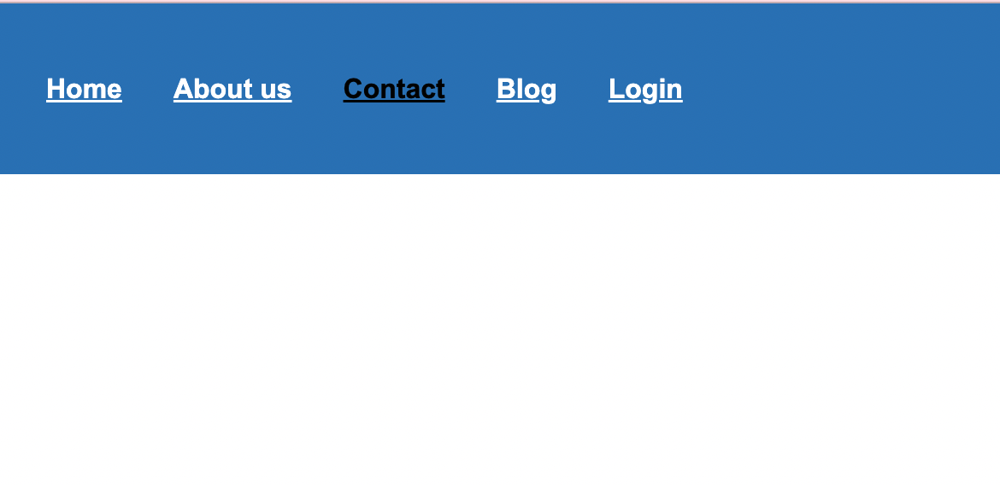
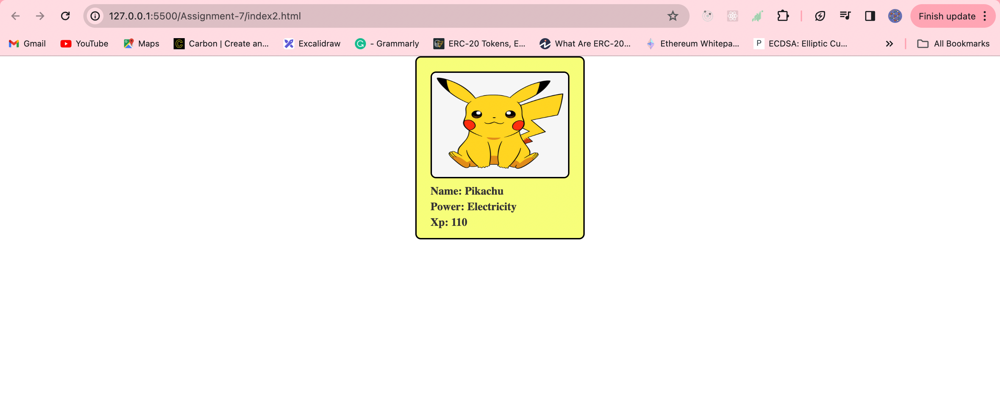
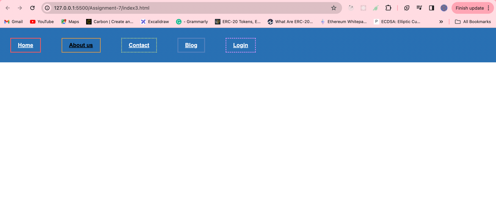
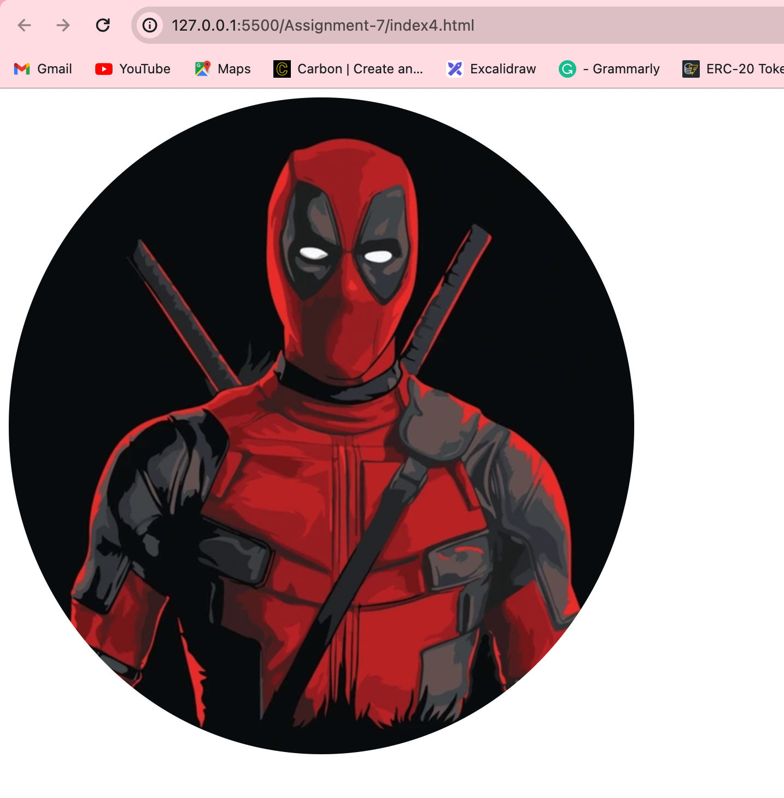
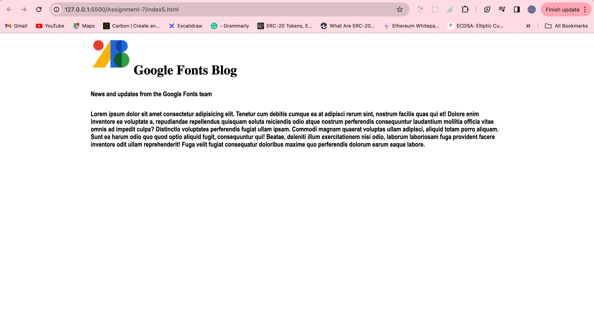
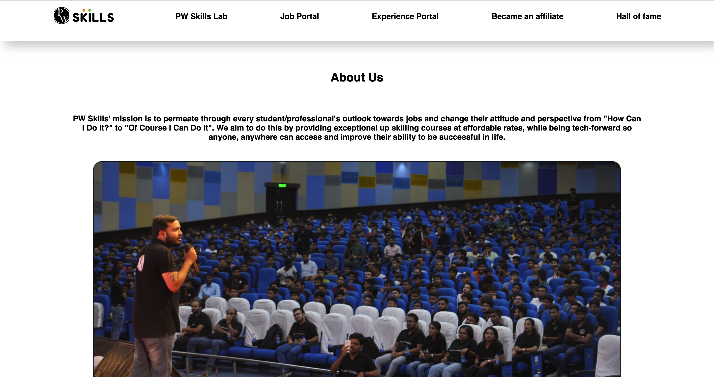
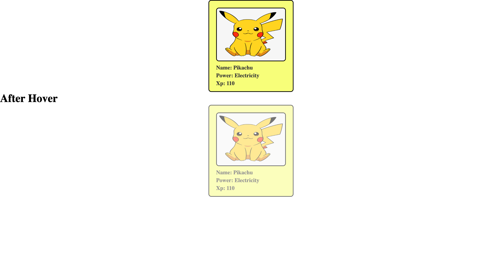

## Assignment 6 - Starting with CSS

### Q1. Create a navbar similar to the below mentioned image. The navigation bar must contain 5 navigation links that are properly placed within the navigation bar using the css box model. The navigation items must change their text color on hover.

Answere: index1.html

### Q2. Create a div centered with an image and paragraph similar to the image mentioned below.

Answere: index2.html

### Q3. Create a nav bar similar to Q1. For each nav item, use a different border style.

Answere: index3.html

### Q4. Create a simple webpage with an image and make the image circular using border-radius.

Answere: index4.html

### Q5. Create a simple blog website about google fonts. The webpage must have the heading with "Oswald" font align center to the page, below the heading have an image fo google fonts and a paragraph about google fonts in font "Montserrat" paragraph font style should be "montserrat" font.

Answere: index5.html

### Q6. Create a simple website as mentioned in the below image. You can get the assets by visiting

Answere: index6.html

### Q7. Create a simple webpage with a card similar to question number 2. The card must be semi-transparent as default and on hovering the card must be displayed clearly. Use Css opacity to achieve this output.

Answere: index7.html

